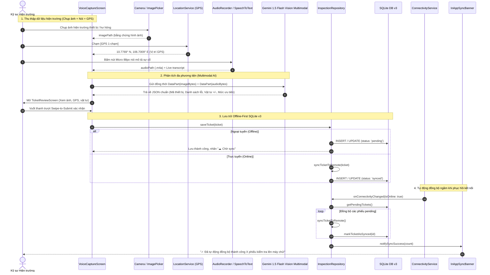

# Field AI Assistant (Trợ Lý Giám Sát & Báo Cáo Hiện Trường AI)

> **Hệ thống di động & web đa nền tảng (Flutter + Gemini Multimodal AI + SQLite Offline-First)** hỗ trợ kỹ sư, giám sát viên công trường, nhà máy tiếp nhận sự cố bằng giọng nói, tự động trích xuất thành phiếu kiểm tra JSON chuẩn hóa, lưu trữ bền bỉ khi mất mạng và tự động đồng bộ lên đám mây khi có kết nối 4G/Wifi.

---

## 1. Vấn Đề Thực Tiễn (Problem Statement)

Tại các môi trường công nghiệp nặng, công trường xây dựng, phân xưởng luyện kim, nhà máy hóa chất và hầm mỏ:
1. **Rào cản môi trường & thao tác**: Tiếng ồn máy móc lớn, bụi bẩn, kỹ sư bắt buộc phải mang găng tay bảo hộ lao động dày. Việc gõ bàn phím ảo hoặc thao tác trên màn hình cảm ứng điện thoại là cực kỳ bất tiện, tốn thời gian và dễ bấm nhầm.
2. **Quy trình thủ công & phân mảnh**: Đa phần việc báo cáo sự cố hiện nay vẫn thực hiện qua sổ tay ghi chép giấy hoặc các nhóm chat rời rạc (Zalo, Telegram, WhatsApp). Điều này dẫn đến tình trạng thất lạc thông tin, thiếu cấu trúc dữ liệu kỹ thuật, và kỹ sư phải mất từ 1 - 2 giờ vào cuối ca chỉ để tổng hợp lại báo cáo.
3. **Mất sóng di động & môi trường ngoại tuyến (Offline)**: Trong các tầng hầm, trạm biến áp, hầm lò hoặc vùng công trình xa xôi, kết nối 4G/Wifi thường xuyên bị gián đoạn hoặc mất hẳn. Các ứng dụng truyền thống phụ thuộc hoàn toàn vào Cloud Backend sẽ bị tê liệt, gây đình trệ công việc kiểm tra.

---

## 2. Giải Pháp Công Nghệ (Solution)

**Field AI Assistant** được thiết kế chuyên biệt để giải quyết triệt để 3 vấn đề trên thông qua sự kết hợp giữa **Voice-first Interface**, **Gemini Multimodal AI** và **Offline-First Architecture**:

### 2.1. Nhập Liệu Bằng Giọng Nói & Bóc Băng Thời Gian Thực (Live STT)
- Kỹ sư chỉ cần nhấn nút micro kích thước lớn và nói tự nhiên mô tả hiện trạng (Ví dụ: *"Tại Phân xưởng cán thép 2 phát hiện van dầu áp lực cao bị nứt gioăng, dầu rỉ tràn sàn có nguy cơ trượt té, cần 2 gioăng chịu dầu DN50 thay thế gấp"*).
- Tích hợp động cơ nhận diện giọng nói tiếng Việt thiết bị (`SpeechToTextService`), hiển thị văn bản bóc băng từng từ trực tiếp ngay trong khi nói.

### 2.2. Trích Xuất Dữ Liệu Có Cấu Trúc Bằng Gemini 1.5 Flash (Multimodal)
- File âm thanh nhị phân (`.m4a` / `.wav`) được truyền trực tiếp lên **Google Gemini 1.5 Flash Multimodal** cùng System Instruction chuẩn hóa.
- Mô hình tự động bóc tách và trả về JSON chuẩn xác không chứa markdown block:
  - **Mã thiết bị / Phương tiện**: Bóc tách tự động (VD: `ELEC-04`, `PUMP-01`, `XL-204`...).
  - **Danh mục & Ưu tiên**: Tự động phân loại (Điện, Cơ khí, Xây dựng, An toàn, HVAC...) và gán mức độ ưu tiên (Thấp, Trung bình, Khẩn cấp).
  - **Danh sách lỗi phát hiện (Cards)**: Tự động tách thành các thẻ lỗi riêng biệt có thể xóa nhanh hoặc thêm mới.
  - **Danh mục vật tư / linh kiện (+/-)**: Bóc tách tên linh kiện và số lượng cần dùng, kèm bộ nút tăng giảm nhanh `+` / `-`.
  - **Bộ Multi-tier Fallback**: 4 tầng bảo vệ (Network Fallback, JSON Clean Regex, Quota Fallback, Local Smart NLP Heuristic) đảm bảo ứng dụng **hoạt động thông suốt 100%, tuyệt đối không bao giờ crash ngay cả khi mất mạng hoặc không có API Key**.

### 2.3. Lưu Trữ Ngoại Tuyến (Offline-First) & Tự Động Đồng Bộ (Background Auto-Sync)
- Lưu trữ toàn bộ dữ liệu vào cơ sở dữ liệu SQLite (`sqflite`) trên thiết bị di động với cột trạng thái: `status: 'synced' | 'pending'`.
- Khi có mạng: Gửi phiếu lên máy chủ -> Gán trạng thái `synced` -> Lưu SQLite.
- Khi mất mạng: Tự động bẫy lỗi an toàn -> Lưu vào SQLite với trạng thái `pending` và hiển thị nhãn `☁ Chờ sync`.
- Dịch vụ giám sát mạng (`ConnectivityService`): Tự động lắng nghe thay đổi trạng thái kết nối. Khi phát hiện 4G/Wifi được phục hồi, hệ thống **tự động quét và gửi lại toàn bộ phiếu chờ đồng bộ lên server trong nền**, chuyển trạng thái thành `☁ Đã sync` mà không cần người dùng thao tác.

### 2.4. Thiết Kế Công Nghiệp & Công Thái Học (Industrial Ergonomics)
- **Industrial Dark Theme**: Nền tối cao cấp (`#0B1120`, `#151E32`), độ tương phản cao, tối ưu hiển thị dưới ánh sáng mạnh ngoài trời và tiết kiệm pin AMOLED.
- **Nút Micro trung tâm lớn (88px)**: Đặt tại vị trí công thái học ngón cái, hiệu ứng chuyển màu mượt mà từ Xanh ngọc (`#10B981`) sang Đỏ cảnh báo (`#EF4444`) kèm sóng radar lan tỏa đa tầng.
- **Timer HUD Kỹ thuật số**: Đồng hồ đếm giây ghi âm chính xác kèm chấm đỏ nhấp nháy `● REC`.
- **Nút trượt công nghiệp (Swipe-To-Submit)**: Cơ chế trượt xác nhận "Vuốt để duyệt & gửi biên bản >>" loại bỏ 100% rủi ro vô tình bấm nhầm khi kỹ sư đang mang găng tay bảo hộ.

### 2.5. Định Vị GPS Hiện Trường & Thông Báo Phản Hồi Đồng Bộ
- **Định vị GPS 1-chạm (`geolocator: ^13.0.1`)**: Chip `[GPS 1-chạm]` tại màn hình duyệt phiếu và màn hình thu âm cho phép kỹ sư lấy tọa độ phần cứng tức thì, chuẩn hóa dạng `10.7769° N, 106.7009° E (Vị trí GPS)` điền thẳng vào biên bản mà không cần nhập tay.
- **Thông báo phản hồi đồng bộ ngầm (`InAppSyncBanner` & `SyncNotificationService`)**: Khi hệ thống phục hồi mạng và hoàn tất đồng bộ tự động các biên bản chờ, ứng dụng phát thông báo nổi: `"✓ Đã tự động đồng bộ thành công X phiếu kiểm tra lên máy chủ!"` với hiệu ứng trượt mượt mà và tự động ẩn.

---

## 3. Kiến Trúc Hệ Thống (Architecture)

Ứng dụng tuân thủ nghiêm ngặt mô hình **Clean Architecture** kết hợp nguyên lý SOLID, phân tách rõ ràng giữa Business Logic, Data Access và Giao diện:

```
build_an_ai_field_assistant/
├── assets/
│   ├── icons/                                  # Biểu tượng ứng dụng
│   └── prompts/
│       └── system_extraction_prompt.txt        # System Instruction & JSON Schema cho Gemini Multimodal
├── lib/
│   ├── app.dart                                # MaterialApp, Dark Theme, Routing
│   ├── main.dart                               # Khởi tạo DI container, SQLite DB, Services
│   │
│   ├── core/                                   # Nền tảng hạ tầng dùng chung
│   │   ├── constants/                          # Bảng màu (AppColors), API endpoints, SQLite constants (v3)
│   │   ├── errors/                             # Exception & Failure classes chuẩn hóa
│   │   ├── network/                            # ApiClient wrapper
│   │   ├── services/                           # AudioRecorder, AudioPlayer, SpeechToText, Connectivity
│   │   │   ├── location_service.dart           # Dịch vụ định vị GPS 1-chạm & format tọa độ
│   │   │   └── sync_notification_service.dart  # Dịch vụ phát thông báo đồng bộ ngầm
│   │   ├── di/                                 # Dependency Injection Locator (GetIt)
│   │   └── utils/                              # DateFormatter, Debouncer, DialogHelper
│   │
│   └── features/
│       └── inspection/                         # Nghiệp vụ cốt lõi: Quản lý & Báo cáo Hiện trường
│           ├── data/
│           │   ├── datasources/
│           │   │   ├── inspection_remote_ds.dart   # Gemini 1.5 Flash Multimodal Vision + Multi-tier Fallback
│           │   │   └── inspection_local_ds.dart    # SQLite DB v3 (Auto-healing) & SharedPreferences
│           │   ├── models/
│           │   │   └── inspection_ticket_model.dart # Serialization, imagePath, InspectionPart mapping
│           │   └── repositories/
│           │       └── inspection_repository_impl.dart # Điều phối Online vs Offline & Auto-sync
│           ├── domain/
│           │   ├── entities/
│           │   │   └── inspection_ticket.dart      # Business Entity (imagePath, equipmentId, InspectionPart)
│           │   └── repositories/
│           │       └── i_inspection_repository.dart # Interface hợp đồng trừu tượng
│           └── presentation/
│               ├── controllers/
│               │   └── inspection_controller.dart  # Quản lý trạng thái phiếu, ghi âm, GPS, lọc và đồng bộ
│               ├── views/
│               │   ├── main_shell_screen.dart      # Shell 3 phân hệ: Tổng quan, Thu âm, Biên bản
│               │   ├── voice_capture_screen.dart   # Chụp ảnh hiện trường, GPS 1-chạm, Nút Micro 88px
│               │   ├── ticket_review_screen.dart   # Duyệt biên bản: Preview ảnh, GPS chip, Parts +/-
│               │   └── ticket_history_screen.dart  # Quản lý danh sách (Tất cả, Chờ sync, Đã sync)
│               └── widgets/
│                   ├── in_app_sync_banner.dart     # Banner thông báo nổi phản hồi đồng bộ ngầm
│                   ├── wave_record_button.dart     # Nút thu âm lớn 88px, sóng radar tỏa, HUD timer
│                   ├── priority_badge_chip.dart    # Chip chọn 3 mức ưu tiên (Thấp, Trung bình, Khẩn cấp)
│                   ├── permission_dialog.dart      # Dialog hướng dẫn cấp quyền Microphone / Camera
│                   └── swipe_to_submit_btn.dart    # Nút trượt công nghiệp xác nhận gửi biên bản
```

### Luồng Hoạt Động Đa Phương Thức & Offline-First (Multimodal Vision Pipeline):


---

## 4. Hạn Chế & Định Hướng Phát Triển (Limitations & Roadmap)

### Hạn Chế Hiện Tại:
1. **Nền tảng Trình duyệt Web**:
   - Engine Speech-to-Text trên Web phụ thuộc vào Web Speech API của trình duyệt (cần internet để nhận dạng giọng nói, khác với Android/iOS hỗ trợ model offline trên máy).
   - SQLite trên Web đang sử dụng giải pháp lưu trữ cache `SharedPreferences` (sẽ được nâng cấp lên SQLite WASM với OPFS trong bản cập nhật sau).
2. **Kích thước tệp âm thanh**: File ghi âm nén AAC 128kbps `.m4a` tối ưu dung lượng nhỏ (~1MB/phút), tuy nhiên trong các ca kiểm tra kéo dài trên 10 phút cần cơ chế chunking file âm thanh thành các đoạn nhỏ.

### Hướng Phát Triển Tương Lai (Roadmap):
- [x] **Camera & Gemini 1.5 Flash Vision Multimodal**: Chụp ảnh thiết bị hỏng, phân tích đồng thời hình ảnh + âm thanh lập biên bản.
- [x] **Định vị GPS Hiện trường 1-chạm**: Lấy tọa độ kinh/vĩ độ chuẩn hóa thời gian thực bằng `geolocator`.
- [x] **Thông Báo Phản Hồi Đồng Bộ Ngầm**: Widget `InAppSyncBanner` thông báo trực quan khi hoàn tất đồng bộ các phiếu chờ trong nền.
- [ ] **Xuất Báo Cáo PDF Tiêu Chuẩn Quốc Tế**: Xuất biên bản kiểm tra ra file PDF đính kèm chữ ký điện tử của kỹ sư trưởng và gửi trực tiếp qua Zalo/Email.

---

## 5. Hướng Dẫn Cài Đặt, Chạy Thử & Đóng Gói (Build & Deploy)

### 5.1. Yêu Cầu Môi Trường
- **Flutter SDK**: `>= 3.13.0` (Khuyến nghị Flutter 3.27+ hoặc 3.47+)
- **Dart SDK**: `>= 3.13.4`
- **Android SDK**: API level 21 - 37 (Đã kiểm thử tối ưu trên Android 16/17)
- **Node.js**: Phiên bản 18+ (Dành cho deploy Vercel CLI)

### 5.2. Cài Đặt Phụ Thuộc
```bash
cd build_an_ai_field_assistant
flutter pub get
```

### 5.3. Chạy Ứng Dụng Trong Môi Trường Phát Triển
- **Chạy trên Android Emulator hoặc thiết bị thật**:
  ```bash
  flutter run
  ```
- **Chạy trên trình duyệt Web (Chrome)**:
  ```bash
  flutter run -d chrome
  ```

### 5.4. Đóng Gói Bản Phát Hành (Production Release Build)

#### Đóng Gói & Triển Khai Bản Web (Vercel / Firebase Hosting):
1. **Build bản Web release**:
   ```bash
   flutter build web --release
   ```
   *Thư mục đầu ra:* `build/web/`
2. **Triển khai lên Vercel**:
   - Dự án đã tích hợp sẵn cấu hình SPA routing tại `web/vercel.json` và `vercel.json`.
   - Triển khai tức thì qua Vercel CLI:
     ```bash
     npx vercel deploy --prod
     ```
   - Hoặc kết nối trực tiếp Repository GitHub `Build-an-AI-Field-Assistant` lên Dashboard [Vercel](https://vercel.com).
3. **Triển khai lên Firebase Hosting**:
   ```bash
   firebase init hosting
   # Chọn thư mục public: build_an_ai_field_assistant/build/web
   # Cấu hình Single-page app: Yes
   firebase deploy --only hosting
   ```

#### Đóng Gói Bản Cài Đặt Android APK:
1. **Build APK Release**:
   ```bash
   flutter build apk --release
   ```
2. **Vị trí file APK thành phẩm**:
   - `build/app/outputs/flutter-apk/app-release.apk`
   - File APK độc lập, có thể cài trực tiếp lên mọi thiết bị Android thông qua lệnh:
     ```bash
     adb install build/app/outputs/flutter-apk/app-release.apk
     ```

---

## 6. Kiểm Thử & Đảm Bảo Chất Lượng Mã Nguồn (QA & Testing)

Dự án áp dụng quy trình kiểm thử tự động toàn diện với **35 bài test đơn vị (Unit Tests)** bao phủ toàn bộ các tầng nghiệp vụ:

### Chạy Phân Tích Tĩnh Cú Pháp (Linter Analysis):
```bash
flutter analyze
# Analyzing build_an_ai_field_assistant...
# No issues found! (ran in 1.6s)
```
*(Kết quả: 0 lỗi, 0 cảnh báo, tuân thủ 100% chuẩn quy tắc flutter_lints)*

### Chạy Toàn Bộ Bộ Kiểm Thử Tự Động:
```bash
flutter test
# 00:01 +35: All tests passed! (35/35 PASS 100%)
```

### Danh Mục Các Bộ Kiểm Thử:
1. `test/widget_test.dart`: Kiểm thử Entity `InspectionTicket` và Model DTO `InspectionTicketModel`.
2. `test/audio_recorder_service_test.dart`: Kiểm thử Audio Pipeline (.m4a/.wav), dọn dẹp file rác khi hủy thu âm, xử lý ngoại lệ Microphone permission.
3. `test/speech_to_text_service_test.dart`: Kiểm thử vòng đời Speech-to-Text và luồng phát dữ liệu bóc băng.
4. `test/ai_extraction_service_test.dart`: Kiểm thử Gemini Multimodal JSON extraction, clean JSON regex, bẫy lỗi mất mạng, bẫy lỗi schema và Smart Heuristic NLP.
5. `test/phase_4_interaction_test.dart`: Kiểm thử tương tác `InspectionPart`, bóc tách `equipmentId`, thẻ lỗi, danh mục vật tư (+/-), nút thu âm 88px và HUD timer.
6. `test/phase_5_offline_sync_test.dart`: Kiểm thử lưu trữ SQLite `synced` vs `pending`, fallback khi server lỗi, và cơ chế tự động đồng bộ ngầm khi `ConnectivityService` phát hiện mạng phục hồi.
7. `test/phase_7_multimodal_image_test.dart`: Kiểm thử Camera Image Picker, bảo toàn `imagePath`, serialization SQLite v3 và Gemini Multimodal Vision.
8. `test/phase_8_gps_and_sync_notification_test.dart`: Kiểm thử 1-chạm lấy tọa độ GPS hiện trường (LocationService), chuẩn hóa kinh vĩ độ, SyncNotificationService phát thông báo và In-app Banner phản hồi đồng bộ ngầm tự động.

## 7. Tác Giả & Bản Quyền
- **Tác giả phát triển**: **Trần Thanh Đạo** ([@ThanhhDaoo](https://github.com/ThanhhDaoo))
- Dự án: **Field AI Assistant — Trợ lý Giám sát & Báo cáo Hiện trường AI**
- Repository: [https://github.com/ThanhhDaoo/Build-an-AI-Field-Assistant](https://github.com/ThanhhDaoo/Build-an-AI-Field-Assistant)
- Giấy phép: MIT License.
